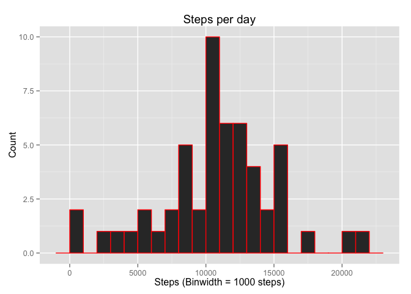
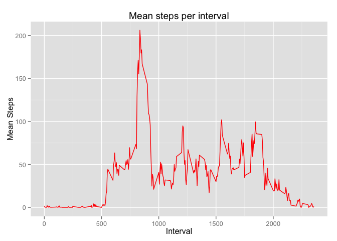
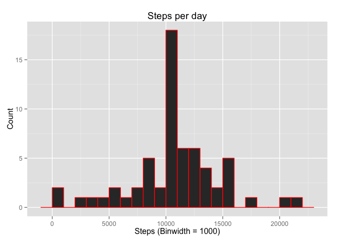
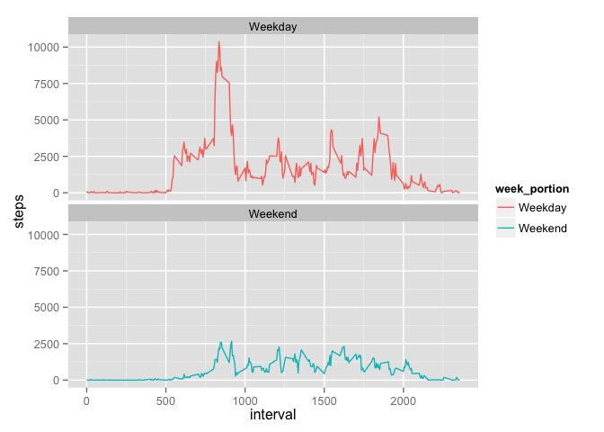

=======  
+ Title: Reproducible Research Project 1 Results  
+ Name of Author: Michael Turner  
+ Date of Publication: December 18th, 2015  
=======

#Introduction

This assignment makes use of data from a personal activity monitoring device. This device collects data at 5 minute intervals through out the day. The data consists of two months of data from an anonymous individual collected during the months of October and November, 2012 and include the number of steps taken in 5 minute intervals each day.

This assignment performs several exploratory analyses on the provided data in order to provide initial insight on human activity patterns that wearable technology measures. This assignment is guided, but presumably, in a real research setting, it would be the basis for spotting patterns that would guide further investigations into activity patterns of wearable technology users.

### Analyses Performed
The analyses performed in this document follow the sections in this assignment directly (Loading and preprocessing the data, What is mean total number of steps taken per day?, What is the average daily activity pattern?, Imputing missing values, Are there differences in activity patterns between weekdays and weekends?), but are renamed for clarity.

0. Global Data Preparation for All Analyses
1. Steps Taken Per Day: The total number of steps taken per day is analyzed via a histogram and describing mean & median of steps/day.
2. Mean Steps Per Sample Interval: The mean number of steps per sampling interval is plotted.
3. Steps Taken Per Day with Substituted Values: Analyses #1 are repeated, but using substituted values for values that were NA in the original dataset
4. Investigation into activity differences on weekdays and weekends:  Done by doing a comparison of mean steps per interval on weekdays and weekends.

We overview these analyses in the following format
1. Data preperation
2. Methods used & results obtained

# 0. Global Data Preparation for All Analyses 
####(i.e. Loading and preprocessing the data)

The data.table, dplyr, lubridate, and ggplot2 libraries are loaded in order to provide data manipulation & plotting functionality


```r
library("data.table")
library("dplyr")
library("lubridate")
library("ggplot2")
```

The data (found [here](https://d396qusza40orc.cloudfront.net/repdata%2Fdata%2Factivity.zip])) is then loaded and coerced into a data table (as defined by the data.table library)


```r
rawData <- read.csv("activity.csv", colClasses = c("numeric", "character", "integer"))
rawData <- data.table(rawData)
```

The data contained in rawData is re-used repeatedly in the subsequent analyses

# 1. Analysis 1 - Steps Taken per Day
####(i.e. What is mean total number of steps taken per day?)
In this analysis, we calculate the number of steps taken per day by the individual and make some initial guesses about what this data says about the individual recorded.

### Data Preperation 

Firstly, a dplyr chain with the summarize function at the end of the chain is used to sum the number of steps each day  and output it into a new data table that will be used for plotting a histogram

```r
stepsPerDay <- summarize(group_by(filter(rawData, !is.na(steps)), date), steps = sum(steps))
```


### Analysis Methods and Results
ggplot2 is used to plot a histogram of the steps per day

```r
ggplot(stepsPerDay, aes(x=steps)) + geom_histogram(col="red", binwidth=1000) +  labs(title = "Steps per day", x = "Steps (Binwidth = 1000 steps)", y = "Count")
```

 

The mean and median of the sample is then stored in a table meant for storing summary statistics

```r
stepStatistics <- data.table(mean = mean(stepsPerDay$steps), median = median(stepsPerDay$steps), NAValueMethod = "Removed")
stepStatistics
```

```
##        mean median NAValueMethod
## 1: 10766.19  10765       Removed
```

The histogram from sample of this individual shows a distribution with a seemingly centralized kurtosis, with the expected value (mean) and median of the sample lying right around 10765 steps per day (calculated with the code below).  10000 steps for most adults is approximately 5 miles, so we can guess that this individual is slightly more active than the average adult.


# 2. Analysis 2 - Mean Steps per Interval
####(i.e. What is the average daily activity pattern?)
In this analysis, we average the number of steps per interval and plot it to see if we can observe any trends as to which parts of the day are most active

### Data Preperation
Again, we use a dplyr chain to create a table that summarizes the number of steps, only this time, showing the mean for each interval rather than sum of steps per each unique date

```r
meanStepsByInterval <- summarize(group_by(filter(rawData, !is.na(steps)), interval), steps = mean(steps))
```

### Analysis Methods and Results
We then plot using ggplot2

```r
ggplot(meanStepsByInterval, aes(x=interval, y=steps)) + geom_line(col="red") +  labs(title = "Mean steps per interval", x = "Interval", y = "Mean Steps")
```

 

And determine that interval 835 contains the maximum number of steps (~206) with a simple dplyr filter

```r
filter(meanStepsByInterval, steps == max(steps))
```

```
## Source: local data table [1 x 2]
## 
##   interval    steps
##      (int)    (dbl)
## 1      835 206.1698
```

Upon looking at this graph, we see that earlier in the day, the number of steps peaks sharply indicating perhaps a regular exercise routine, walking commute, or daily professional activity that involves a lot of steps.

# 3.  Analysis 3 - Steps Taken Per Day with Substituted Values
####(i.e. Imputing missing values)
In this analysis, we repeat analysis 1, but subsitute numeric values where NA values exist in order to lessen the bias excluding the NA values may introduce.  The substitution we use in this case is the average number of steps for each interval where an NA value for number of steps exists.

###Data Preparation
First we check where the NA values are and how many there are with a dplyr chain.  We see that NA values only exist in the "steps" column at a count of 2304.

```r
summarize(rawData, NAsteps=sum(is.na(steps)), NAdate=sum(is.na(date)),
          NAinterval=sum(is.na(interval)))
```

```
##    NAsteps NAdate NAinterval
## 1:    2304      0          0
```

With this knowledge, we create a new table to store data without NA values and implement our chosen strategy (replacing NA values with the mean number of steps for that interval) for filling in those values using a for loop and then take the sum of the steps per day using a dplyr chain.


```r
cleanedData <- rawData
for (i in 1:length(cleanedData$steps)) { 
        if (is.na((cleanedData[i,][[1]]))) cleanedData[i,][[1]] = meanStepsByInterval[meanStepsByInterval$interval == cleanedData[i,][[3]],][[2]]
}
cleanedDataStepsSum <- summarize(group_by(cleanedData, date), steps = sum(steps))
```

### Analysis Methods and Results
Afterwards, we use a simple ggplot2 historgram to plot the results 

```r
ggplot(cleanedDataStepsSum, aes(x=steps)) + geom_histogram(col="red", binwidth=1000) +  labs(title = "Steps per day", x = "Steps (Binwidth = 1000)", y = "Count")
```

 

We also examine the new mean and median (which we store in our stepStatistics dataframe)


```r
stepStatistics <- rbind(stepStatistics, list(mean(cleanedDataStepsSum$steps), mean(cleanedDataStepsSum$steps), "Step Mean Substituted"))
stepStatistics[2,]
```

```
##        mean   median         NAValueMethod
## 1: 10766.19 10766.19 Step Mean Substituted
```

We see that our histogram varies very little from the original histogram, indicating  removing NA values introduces very little bias.  Additionally comparing the mean and median of the subsituted data with the original NA-valued data, shows very little deviation from the mean and median originally computed.

```r
stepStatistics
```

```
##        mean   median         NAValueMethod
## 1: 10766.19 10765.00               Removed
## 2: 10766.19 10766.19 Step Mean Substituted
```

# 4.  Analysis 4 - Investigation into activity differences on weekdays and weekends
#### (i.e. Are there differences in activity patterns between weekdays and weekends?)
In this analysis, we plot the steps taken per interval on both weekdays and weekends to see if we notice any difference in activity levels between the two timeframes.

### Data Preparation
Using the data with substituted values, we create another column.  In this column we use lubridate to identify which day of the week each date is and then classify those data as either weekends or weekdays and cast them into factor variables.  Finally we use a dplyr chain to create a 3 column data table that shows the mean number of steps per interval both for weekdays AND weekends.


```r
cleanedData$week_portion = cleanedData$date
cleanedData$week_portion[wday(cleanedData$date) %in% c(1,7)] <- "Weekend"; cleanedData$week_portion[wday(cleanedData$date) %in% c(2,3,4,5,6)] <- "Weekday"
cleanedData$week_portion<-as.factor(cleanedData$week_portion)
Sumbyweekportion <- summarize(group_by(cleanedData, interval, week_portion), steps = sum(steps))
```

### Analysis Methods and Results
We use ggplot to plot the comparison of steps taken per intervals on weekends and weekdays

```r
ggplot(Sumbyweekportion, aes(x=interval, y=steps, color = week_portion)) +
    geom_line() +
    facet_wrap(~week_portion, ncol = 1, nrow=2)
```

 

What we see immediately is that there is a CLEAR difference between weekday and weekend activity for this individual.  Their weekdays appear far more active.
